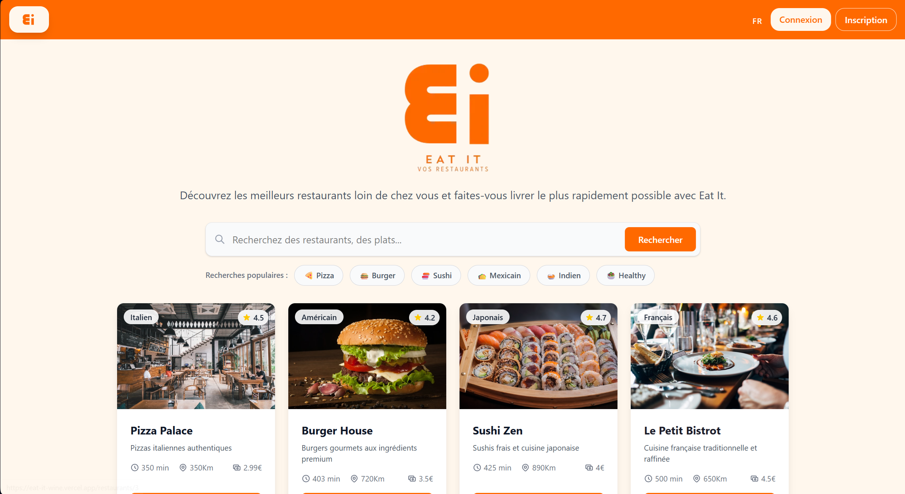

[](https://vercel.com/ky-oos-projects/eat-it)

[](https://github.com/Ky-oo/Eat_It/actions/workflows/deploy.yaml)

# Eat It 🍕



Une application de livraison de nourriture moderne construite avec Nuxt 4, Vue 3 et Tailwind CSS.

## 📋 Fonctionnalités

- 🏪 **Catalogue de restaurants** - Parcourez une sélection de restaurants avec leurs spécialités
- 🔍 **Recherche et filtres** - Recherchez par nom de restaurant ou filtrez par type de cuisine
- 🍽️ **Menu détaillé** - Consultez les menus complets avec descriptions et prix
- 🛒 **Panier intelligent** - Ajoutez des articles au panier avec gestion des quantités
- 📱 **Design responsive** - Interface optimisée pour mobile et desktop
- ⚡ **Performance** - Application rapide avec rendu côté serveur (SSR)

## 🛠️ Technologies utilisées

- **Frontend**: Nuxt 4, Vue 3, TypeScript
- **Styling**: Tailwind CSS 4
- **State Management**: Pinia
- **API**: API Routes Nuxt/Nitro
- **Data**: JSON local avec types TypeScript

## 🚀 Installation

### Prérequis

- Node.js 18+
- npm, yarn, pnpm ou bun

### Setup

1. **Cloner le repository**

```bash
git clone <url-du-repo>
cd eat_it
```

2. **Installer les dépendances**

```bash
# npm
npm install

# pnpm
pnpm install

# yarn
yarn install

# bun
bun install
```

## 💻 Développement

Démarrer le serveur de développement sur `http://localhost:3000`:

```bash
# npm
npm run dev

# pnpm
pnpm dev

# yarn
yarn dev

# bun
bun run dev
```

## 📁 Structure du projet

```
eat_it/
├── app/                          # Code source de l'application
│   ├── components/              # Composants Vue réutilisables
│   │   ├── FloatingCart.vue     # Panier flottant
│   │   ├── HeroRestaurant.vue   # En-tête restaurant
│   │   ├── ItemCard.vue         # Carte d'article de menu
│   │   ├── MenuItemModal.vue    # Modal détail d'article
│   │   ├── RestaurantCard.vue   # Carte de restaurant
│   │   ├── RestaurantGrid.vue   # Grille de restaurants
│   │   └── ...
│   ├── layouts/                 # Layouts de l'application
│   │   └── default.vue         # Layout principal
│   ├── pages/                   # Pages et routing
│   │   ├── index.vue           # Page d'accueil
│   │   ├── cart.vue            # Page panier
│   │   └── restaurants/        # Pages restaurants
│   │       └── [restaurant_id].vue
│   ├── stores/                  # Stores Pinia
│   │   └── Cart.ts             # Store du panier
│   └── app.vue                 # Composant racine
├── modules/                     # Modules de l'application
│   └── restaurant/             # Module restaurant
│       └── types/              # Types TypeScript
│           └── index.ts        # Interfaces Restaurant & MenuItem
├── public/                      # Assets statiques
├── nuxt.config.ts              # Configuration Nuxt
└── package.json                # Dépendances
```

## 🌟 Fonctionnalités principales

### 🏪 Restaurants

- Affichage en grille avec images, ratings et infos
- Filtrage par type de cuisine (Pizza, Burger, Sushi, etc.)
- Recherche par nom de restaurant
- Pages détaillées avec menus complets

### 🛒 Panier

- Ajout/suppression d'articles
- Gestion des quantités
- Calcul automatique des totaux
- Persistance entre les pages
- Interface flottante accessible partout

### 📱 UX/UI

- Design moderne et épuré
- Animations fluides
- Feedback visuel (hover, loading, etc.)
- Navigation intuitive
- Responsive design

## 🎨 Design System

L'application utilise une palette de couleurs cohérente basée sur :

- **Primary**: Orange (#F97316) - Actions et éléments importants
- **Secondary**: Gris - Textes et éléments secondaires
- **Background**: Gris clair (#F9FAFB) - Arrière-plans
- **Cards**: Blanc avec ombres subtiles

## 🏗️ Architecture Atomique

L'application suit les principes du **Atomic Design** de Brad Frost pour une meilleure organisation des composants :

### 🔬 Atoms (Atomes)

Composants de base, les plus petites unités de l'interface :

- `PageTitle.vue` - Titres de pages
- `NoRestaurants.vue` - Messages d'état vide
- `icons/PlusIcon.vue` - Icône d'ajout
- `icons/MinusIcon.vue` - Icône de soustraction

### 🧬 Molecules (Molécules)

Combinaisons d'atomes qui forment des unités fonctionnelles :

- `QuantitySelector.vue` - Sélecteur de quantité (utilise PlusIcon + MinusIcon)
- `PopularSearchChips.vue` - Puces de recherche populaire
- `RestaurantDescription.vue` - Description de restaurant

### 🦠 Organisms (Organismes)

Groupes de molécules formant des sections complexes :

- `ItemCard.vue` - Carte d'article de menu
- `RestaurantCard.vue` - Carte de restaurant
- `MenuItemModal.vue` - Modal de détail d'article
- `RestaurantGrid.vue` - Grille de restaurants
- `RestauranMenu.vue` - Menu de restaurant complet
- `FloatingCart.vue` - Panier flottant
- `HeroRestaurant.vue` - En-tête de restaurant
- `RestaurantSearchBar.vue` - Barre de recherche
- `PopularSearches.vue` - Recherches populaires

## 📊 API Endpoints

### Restaurants

```
GET /api/restaurants           # Liste tous les restaurants
GET /api/restaurants/{id}      # Détails d'un restaurant
```

## 🏗️ Production

Construire l'application pour la production :

```bash
# npm
npm run build

# pnpm
pnpm build

# yarn
yarn build

# bun
bun run build
```

Prévisualiser la build de production localement :

```bash
# npm
npm run preview

# pnpm
pnpm preview

# yarn
yarn preview

# bun
bun run preview
```

## 📝 Scripts disponibles

- `dev` - Démarre le serveur de développement
- `build` - Construit l'application pour la production
- `generate` - Génère un site statique
- `preview` - Prévisualise la build de production
- `postinstall` - Prépare Nuxt après installation

## 🤝 Contribution

1. Fork le projet
2. Créer une branche feature (`git checkout -b feature/AmazingFeature`)
3. Commit vos changements (`git commit -m 'Add some AmazingFeature'`)
4. Push vers la branche (`git push origin feature/AmazingFeature`)
5. Ouvrir une Pull Request

## 📄 Licence

Ce projet est sous licence MIT. Voir le fichier `LICENSE` pour plus de détails.

## 📞 Support

Pour toute question ou suggestion, n'hésitez pas à ouvrir une issue sur GitHub.

---

**Eat It** - Votre application de livraison de nourriture préférée ! 🚀
